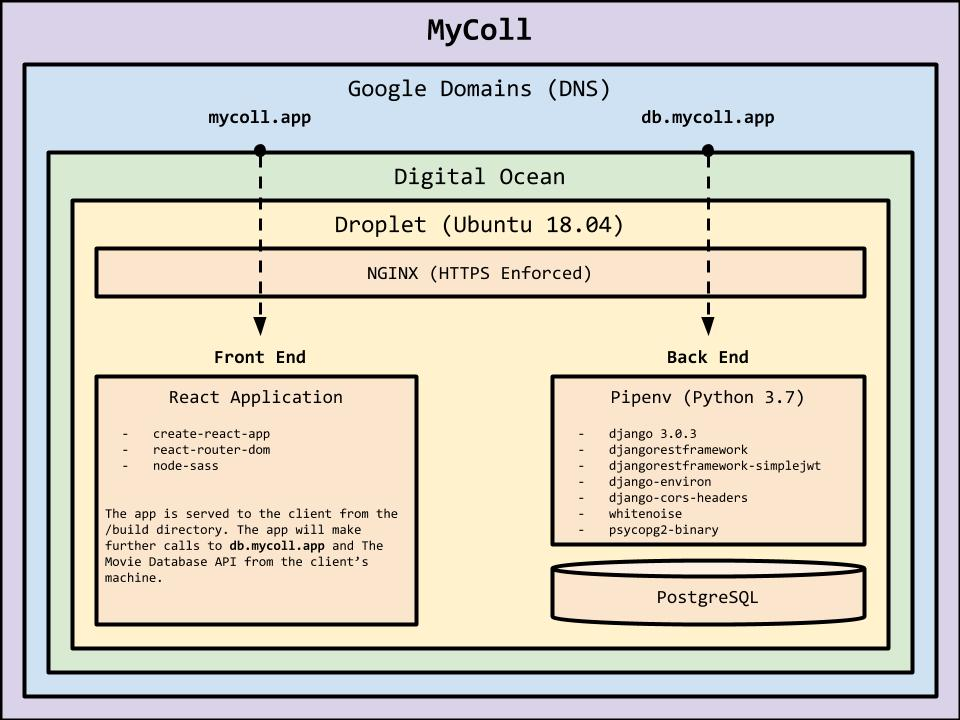

# MyColl Back End

## What is MyColl?

[MyColl](https://mycoll.app), pronounced 'Michael' but short for 'my collection', is a web app for cataloging your media collection. With MyColl you can search The Movie Database API to effortlessly add movies to your collection, then record any copies you may own along with its format and platform details. Now you'll know if your copy of Michael Chrichton's 1998 aquatic-horror thriller, Sphere, is a DVD sitting at home on your shelf, a VOD on a service like Amazon's Prime Video, or both! Currently the application supports movies but cataloging of shows and books will be integrated.

## Architecture:

### Frameworks, Packages, and Libraries
- [**Django**](https://www.djangoproject.com/): A Python framework for building web applications and servers
- [**`djangorestframework`**](https://www.django-rest-framework.org/): A package for quickly developing REST APIs with Django
- [**`djangorestframework-simplejwt`**](https://github.com/davesque/django-rest-framework-simplejwt): A package for enabling JSON Web Tokens for user auth
- [**`django-environ`**](https://github.com/joke2k/django-environ): A package for handling environment variables
- [**Docker** & **Docker-Compose**](https://www.docker.com/): A protocol for containerization, used during development only
- [**`pyscopg2-binary`**](https://github.com/psycopg/psycopg2): A package for allowing communication between Python and a PostgreSQL database
- [**`requests`**](https://2.python-requests.org/en/master/): A package for handling HTTP/HTTPS requests
- [**`whitenoise`**](https://github.com/evansd/whitenoise): A package for managing static files

### Models
- **Movie**: Models a unique film in your collection.
- **MovieCopy**: Models a specific copy of a film in your collection whether video-on-demand (VOD) or DVD.

### API
- **accounts/**
  - **create/**
    - **POST**: Create a new user and receive a JWT pair to authenticate further requests
  - **token/**
    - **POST**: Submit login credentials to receive a JWT pair to authenticate further requests
  - **token/refresh/**
    - **POST**: Submit a refresh token to receive a new access token to authenticate further requests
- **api/v1/**
  - **movies/**
    - **GET**: A list view of all of the movies in your collection
    - **POST**: Add a new movie to your collection
  - **movies/\<id>**
    - **GET**: A detail view of a specific movie in your collection
    - **PUT**: Update the details of a specific movie in your collection
    - **DELETE**: Delete a movie and its related copies from your collection
  - **movies/copies/**
    - **GET**: A list view of all of the movie copies in your collection
    - **POST**: Add a new copy of a movie to your collection
  - **movies/copies/\<id>**
    - **GET**: A detail view of a specific copy of a movie in your collection
    - **PUT**: Update the details of a specific copy of a movie in your collection
    - **DELETE**: Delete a specific copy of a movie from your collection
  - **movies/search**
    - **GET**: A list of search results from The Movie Database. Requires a single 'query' param that is the title of the requested movie
  - **movies/search/details**
    - **GET**: A set of details regarding a specific movie from The Movie Database (TMDb). Requires a single 'query' param that is the requested movie's ID on TMDb

### Full Stack Diagram

    
## Roadmap
- Add Show model
- Add TMDb API integration for searching shows
- Add Book model
- Add Google Books API integration for searching books
